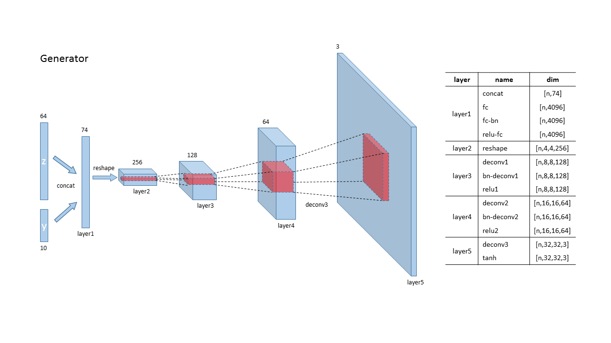
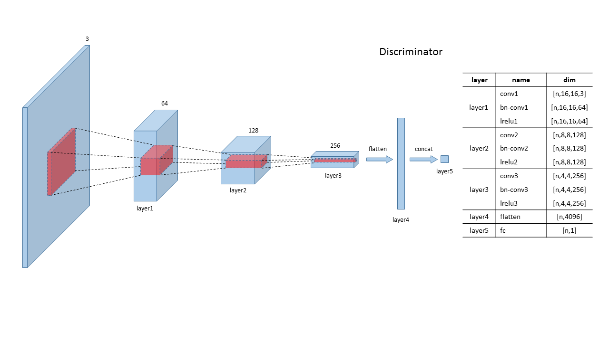

# DCGAN
TensorFlow implementation of Deep Convolutional Generative Adversarial Networks.

## Architectures

## Discription
- This code is highly inspired by the implementation by [carpedm20](https://github.com/carpedm20/DCGAN-tensorflow). But there is a little difference.
- Result: I sample during the training process and get 100 images, and make each them all of a dataset into a gif using the python package scipy. Detail can be found in this script [helper/tools.py](./helper/tools.py)
	
       

	
## plans for future:
- [ ] celeA
- [ ] lsun

## Prerequisites
- Python 3.5
- TensorFlow 1.2

## Reference
- [Deep Convolutional Generative Adversarial Networks](http://arxiv.org/abs/1511.06434)